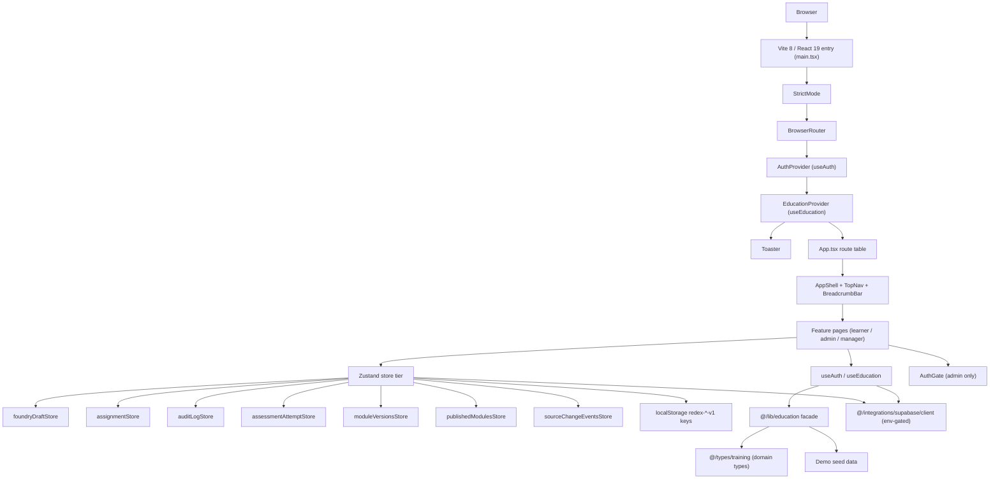

# Redex Education Architecture

## 1) One-line summary
Redex Education is a Vite + React 19 + TypeScript app. Today it ships the Phases 0–7 mock vertical: learner flow, Course Foundry surfaces, assignments, manager visibility, publishing/versioning, source-impact review, and audit log. Phase 8 backend integration is in progress: Slices 8.1–8.2 are complete, while Supabase reads/writes, type regeneration, and production RLS remain outstanding. Current Slice 9.2 verification baseline is 426 passing tests, 1 skipped, 86 test files (docs-only changes should not alter it).

## 2) The big picture (Mermaid diagram)


`src/main.tsx` stacks providers top-down as StrictMode → BrowserRouter → AuthProvider → EducationProvider, then renders both `<App />` and `<Toaster />` inside the provider boundary. `src/App.tsx` owns the route table and wraps route surfaces in `AppShell`, which composes shared layout chrome (`TopNav`, `BreadcrumbBar`).

UI-facing domain/data access goes through the education facade in `src/lib/education/index.ts`, which re-exports canonical domain types from `src/types/training.ts` and demo seed data behind one import path. Feature-local state that must survive reloads uses Zustand `persist` stores under `redex-*-v1` localStorage keys; those stores become adapters when Supabase reads/writes land. Supabase is env-gated in `src/integrations/supabase/client.ts`; when `VITE_MOCK_AUTH === 'true'`, `AuthGate` bypasses session enforcement for demo/dev flows.

## 3) Route table
Grounded in `src/App.tsx`:

| Path | Component | AppShell | AuthGate | Notes |
|---|---|---|---|---|
| `/` | `<Navigate to="/learn" replace />` | — | — | Root redirect |
| `/learn` | `LearnerDashboardRoute` → `LearnerDashboardPage` | ✓ | — | Default landing |
| `/learn/welcome` | `LearnerWelcomeRoute` → `LearnerWelcomePage` | ✓ | — | First-day welcome |
| `/learn/player` | `LearnerModuleRoute` (defaults `moduleId='hr-basics-mod-001'`) | ✓ (`playerMode`) | — | Module player |
| `/learn/player/:moduleId` | `LearnerModuleRoute` | ✓ (`playerMode`) | — | Unknown id → `<Navigate to="/learn" replace />` |
| `/admin`, `/admin/*` | `AdminRoute` → `AdminDashboardPage` | ✓ | ✓ | Redex AI Course Foundry dashboard + fallback |
| `/admin/assignments` | `AssignmentAdminRoute` → `AssignmentAdminPage` | ✓ | ✓ | Assignment admin surface |
| `/admin/audit` | `AuditLogRoute` → `AuditLogPage` | ✓ | ✓ | Audit log review surface |
| `/admin/source-impact` | `SourceImpactReviewRoute` → `SourceImpactReviewPage` | ✓ | ✓ | Source-change impact review |
| `/admin/modules/:moduleId/versions` | `ModuleVersionHistoryRoute` → `ModuleVersionHistoryPage` | ✓ | ✓ | Module version history |
| `/manager` | `ManagerRoute` → `ManagerDashboardPage` | ✓ | — | Manager team-training dashboard |
| `/admin/foundry/start` | `FoundryStartRoute` → `FoundryStartPage` | ✓ | ✓ | Course Foundry module basics form |
| `/admin/foundry/source` | `FoundrySourceRoute` → `SourceBinderInputPage` | ✓ | ✓ | Course Foundry source binder — paste markdown, parse headings into sections, preview |
| `/admin/foundry/questions` | `FoundryQuestionsRoute` → `FoundryQuestionsPage` | ✓ | ✓ | Course Foundry setup questions wizard — captures criticality, assessment style, audience, source control, approval gates |
| `/admin/foundry/outline` | `OutlineReviewRoute` → `OutlineReviewPage` | ✓ | ✓ | Course Foundry generated outline review — approve / edit / regenerate proposed module structure |
| `/admin/foundry/preview` | `ModuleGenerationPreviewRoute` → `ModuleGenerationPreviewPage` | ✓ | ✓ | Course Foundry full module generation preview — generates all lessons in one click; status-tagged; not published |
| `/admin/foundry/critique` | `SelfCritiqueReviewRoute` → `SelfCritiqueReviewPage` | ✓ | ✓ | Course Foundry AI self-critique — flagged issues with severity; high-severity blocks publish until resolved or ignored |
| `/admin/foundry/sidebyside` | `SideBySideReviewRoute` → `SideBySideReviewPage` | ✓ | ✓ | Course Foundry side-by-side generated/source comparison — per-lesson approve/regeneration with confidence + unsupported claim flags |
| `/admin/foundry/blockers` | `PublishBlockersRoute` → `PublishBlockersPage` | ✓ | ✓ | Course Foundry publish blockers — aggregated view of missing-source + critique + unsupported-claim blockers across the module |
| `/admin/foundry/library` | `SourceLibraryRoute` → `SourceLibraryPage` | ✓ | ✓ | Course Foundry source library — browse Drive-ingested source files with authority + version |
| `*` | `NotFoundRoute` → `NotFoundPage` | ✓ | — | Catchall |

## 4) Provider stack
`src/main.tsx`:

```tsx
<StrictMode>
  <BrowserRouter>
    <AuthProvider>
      <EducationProvider>
        <App />
        <Toaster position="top-center" richColors closeButton />
      </EducationProvider>
    </AuthProvider>
  </BrowserRouter>
</StrictMode>
```

- `StrictMode`: development-time double-mount safety checks.
- `BrowserRouter`: outside app providers so route APIs are globally available.
- `AuthProvider` before `EducationProvider`: keeps user/session context above education state for future cross-cutting concerns.
- `Toaster` inside the provider boundary as a sibling to `App`, so toast flows can read app context if needed.

## 5) The education facade pattern
Contract used by UI imports:

```ts
import type { Lesson, Module } from '@/lib/education'
import { DEMO_LESSONS } from '@/lib/education'
```

Rule enforced by module boundaries in `src/lib/education/index.ts`: UI imports from `@/lib/education`, not directly from `@/types/training` and not from `@/integrations/supabase/db-rows`.

Why this matters: the facade centralizes domain exports and seed data now, while preserving a stable consumer surface when data plumbing changes (demo/local-first today, Supabase-backed later). It also keeps Row-vs-Domain concerns at the integration boundary (`src/integrations/supabase/db-rows.ts`) instead of leaking into components.

## 6) Hook / provider split convention
Current split across auth and education:

- `src/hooks/auth-context.ts` / `src/contexts/education-context.ts` define `createContext` and value types.
- `src/hooks/use-auth.tsx` / `src/contexts/EducationContext.tsx` define provider components.
- `src/hooks/useAuth.ts` / `src/hooks/useEducation.ts` define public hook seams.

Rationale: this separation supports fast-refresh lint constraints (`react-refresh/only-export-components`) and keeps tests able to mock hook seams directly without booting full provider runtime.

## 7) Auth scaffold (current state)
From `src/hooks/use-auth.tsx`, `src/hooks/useAuth.ts`, `src/hooks/auth-context.ts`, and `src/components/auth/AuthGate.tsx`:

- `AuthProvider` subscribes to `supabase.auth.onAuthStateChange`, then resolves initial state with `supabase.auth.getSession()`.
- `useAuth()` reads `AuthContext` and throws if used outside provider scope.
- `AuthGate` enforces three branches:
  - `VITE_MOCK_AUTH === 'true'` → render children directly (demo/dev bypass)
  - `loading` → render fallback (`Authenticating…` by default)
  - `!session` → render "Sign-in required" placeholder

Sign-in UI and redirect-back behavior are intentionally deferred. Today `AuthGate` is applied only to `/admin` and `/admin/*`; learner routes remain intentionally open.

## 8) Education progress state and store layer
From `src/contexts/EducationContext.tsx`, `src/contexts/education-context.ts`, and the Zustand stores under `src/features/**/store`:

- Source of truth today is split across seven client persistence surfaces: `EducationProvider` under `redex-education-progress-v1`, plus six Zustand stores under `redex-assignments-v1`, `redex-audit-log-v1`, `redex-assessment-attempts-v1`, `redex-module-versions-v1`, `redex-published-modules-v1`, and `redex-source-change-events-v1`. `foundryDraftStore` adds the seventh Zustand store key, `redex-foundry-draft-v1`.
- All current persistence keys follow the `redex-*-v1` convention.
- `EducationProvider` hydration is synchronous via `useState(() => restoreLessonProgress())`, which is StrictMode-safe.
- Idempotency guard: `recordLessonProgress` is a by-reference no-op when a lesson is already completed and another completed write is attempted.
- Progress scoping: `getProgressSummary(courseId)` derives module IDs from `DEMO_MODULES`, filters `DEMO_LESSONS`, and returns `{ completed, total, percentage }` (including zeroed output when nothing matches).
- Planned evolution: server-side Supabase rows become the source of truth after Slice 8.4; `localStorage` is demoted to offline-cache-only in Slice 12.4. Row mappers/queries should preserve the current facade-facing hook and store surfaces during that transition.

## 9) Brand tokens / design system
`src/index.css` defines locked tokens at `:root`, including `--redex-red`, `--redex-red-hover`, `--redex-red-active`, `--redex-black`, `--redex-offwhite`, plus status tokens `--success` and `--warning`. Tailwind utilities use namespaced classes like `bg-redex-red` and `text-redex-red`.

Hard rule from the remediation phases: do not introduce raw hex literals for Redex red in UI code; use tokenized utilities or CSS variables.

Reference: [Redex Brand Guide v1.0 (PDF)](./Redex_Brand_Guide_v1.0.pdf).

## 10) Build pipeline
From `vite.config.ts` and TS config usage:

- Build/runtime stack: Vite 8 + `@vitejs/plugin-react`.
- TypeScript posture: `strict: true`, `noUncheckedIndexedAccess: true`, and `build.target: 'es2023'`.
- `manualChunks` vendor strategy:
  - `react-vendor` (`react`, `react-dom`, `scheduler`, `react-router*`)
  - `markdown-vendor` (`react-markdown`, `rehype-*`, `remark-*`, `unified`, `unist-*`, `mdast-*`, `hast-*`, `micromark`)
  - `supabase-vendor` (`@supabase/*`)
  - `vendor` fallback
- Coverage config: V8 provider, `text` + `html` + `json-summary` reporters, with explicit excludes for entry wiring, type-only files, generated supabase types, row-boundary aliases, demo seed data, and test helpers.

## 11) Security posture
From `src/integrations/supabase/client.ts` and `netlify.toml`:

- Secrets/config flow through `import.meta.env.VITE_*`; `.env.example` provides template values.
- Supabase client is env-gated and fails loud in dev when required keys are missing and mock auth is not enabled.
- Netlify headers enforce:
  - CSP with `self` plus Supabase HTTPS/WSS connectivity
  - `X-Content-Type-Options: nosniff`
  - `X-Frame-Options: DENY`
  - `Referrer-Policy: strict-origin-when-cross-origin`
  - `Permissions-Policy` deny defaults for high-risk browser features
  - `Strict-Transport-Security: max-age=31536000; includeSubDomains`
- Markdown rendering path uses `react-markdown` with `rehype-sanitize` in the learner renderer stack, preventing raw-script injection surfaces in lesson content.

## 12) Known architecture gaps (deferred)
Current deferred items called out by architecture surfaces and phase notes:

- `body { background-color: var(--bg-canvas) }` still paints a black canvas beneath light surfaces (legacy visual carryover).
- CSP allowlist is intentionally minimal and does not include future providers like analytics, Google Fonts, or Stripe.
- CSP must widen to allow Supabase Storage origin (Slice 10.8 embedded source images) and HeyGen video URLs (Slice 10.6). ADR 008 remains the canonical CSP allowlist record and must be updated when those slices ship.
- CI automation is not yet wired; verification is currently script-driven (`npm run typecheck`, `npm run lint`, `npm test`, `npm run build`).
- `_archive/` remains in-repo for historical context and is excluded from active lint/test coverage concerns.
- Production auth UX (sign-in, redirect-back, role-aware gating) remains intentionally deferred.

For decision rationale behind these choices, see [Decisions (ADRs)](./decisions/README.md).
