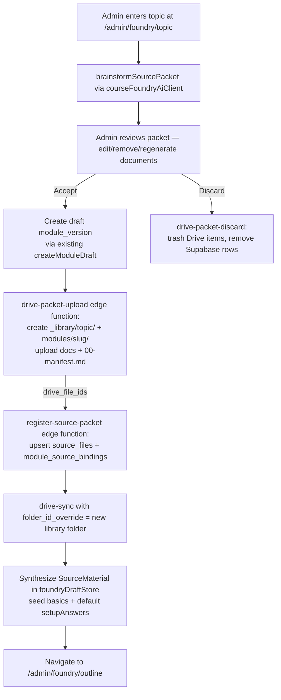

# Course Foundry — Option B: Topic-to-Packet Entry Flow

**Status:** Draft design (no implementation)
**Date:** 2026-05-25
**Author:** Foundry architecture design pass
**Phase / Slice target:** New flow grafted onto Foundry stepper (pre-`basics`), gated behind feature flag

---

## 1. Context and intent

Today, an admin starting a new module enters `/admin/foundry/start`, fills the **Module Basics** form, then has to either (a) paste markdown in the Source Binder, or (b) browse the Source Library for files an SME has already placed on Drive. The first option produces ungrounded, unversioned content; the second only works when authoritative material *already exists* on Drive.

**Option B** introduces a third — and intended-to-be primary — entry path: the admin types a topic ("Cat 6 Training Module") and the Foundry:

1. **Brainstorms a starter source packet** (3–6 candidate documents with bodies, titles, frontmatter, and authority defaults).
2. **Creates the canonical Drive structure** under `_library/<topic>/` and `modules/<slug>/`.
3. **Uploads the packet** (markdown documents + `00-manifest.md`) to Drive.
4. **Captures the returned Drive file IDs**.
5. **Registers Supabase records** (`source_files`, `module_source_bindings`) for the new module-version draft.
6. **Triggers a scoped `drive-sync`** so versions, sections, and authority are parsed exactly the way SME-uploaded material would be.
7. **Lands the admin on `/admin/foundry/outline`** with basics, source material, and reasonable setup-question defaults pre-filled.

The flow is additive: the existing Source Binder and Source Library remain the canonical paths for *importing* existing SME material. Option B is the canonical path for *bootstrapping* a module on a topic that doesn't yet have a Drive presence.

> **Anchor decision:** Brainstormed content is **never** authoritative. It defaults to `authority: 'context'` with a new `authority_provenance: 'brainstormed'` flag; promotion to `authoritative` requires an explicit SME approval action. This keeps ADR 010's "Drive is the single source of truth" property intact — Drive is still the registry, but the system marks AI-drafted material as needing human ratification.

---

## 2. End-to-end flow



Each numbered arrow above corresponds to a durable `packet_state` checkpoint stored in `foundry_draft_metadata` so any interruption (refresh, network failure, browser close) resumes at the correct substep.

---

## 3. Touched surfaces

### 3.1 New surfaces

| Surface | Kind | Purpose |
|---|---|---|
| `/admin/foundry/topic` | Route | Topic entry + brainstormed-packet review |
| `TopicEntryPage`, `TopicEntryForm`, `BrainstormedPacketReview`, `PacketUploadProgress`, `PacketDiscardDialog` | React components | Phase-2 UI |
| `foundryDraftStore.packetDraft` | Zustand slice | `{ topic, packet, packet_state, drive_folder_ids, source_file_ids, library_topic_slug, module_folder_slug }` |
| `brainstormSourcePacket(input)` | `CourseFoundryAiClient` method (mock + real) | Returns `BrainstormedPacket` schema |
| `drive-packet-upload` | Supabase edge function | Creates Drive folders, uploads docs + manifest |
| `register-source-packet` | Supabase edge function | Atomic Supabase write: `source_files`, `module_source_bindings` |
| `drive-packet-discard` | Supabase edge function | Trashes Drive items + deletes Supabase rows for an aborted packet |
| `redex.source_files.authority_provenance` | New column | `'brainstormed' \| 'human_authored' \| 'imported'` |
| `redex.library_topics` | New table (optional) | Topic-slug uniqueness registry; or use a unique index on `source_files.topic` |
| ADR 0xx | Decision record | "Brainstormed source packets default to `context` authority" |
| ADR 010 amendment | Decision record | Add `drive.file` scope alongside `drive.readonly` |

### 3.2 Modified surfaces

| Surface | Change |
|---|---|
| `_shared/google-jwt.ts` | Add `drive.file` scope to the JWT assertion (kept narrow — only files created by the app) |
| `drive-sync/index.ts` | No code change required; existing `folder_id_override` is reused |
| `FoundryStepper.tsx` | Insert `{ key: 'topic', label: 'Topic' }` as step 0; map `/admin/foundry/topic` → `'topic'` |
| `foundryDraftStore.ts` | Add `packetDraft` slice + `setPacketState`, `attachPacketUploadResult`, `discardPacket` actions; extend `persistDraftStage` enum with `'topic'` |
| `FoundryDraftStage` type in `@/types/training` | Add `'topic'` |
| `SourceLibraryBrowser.tsx` | Render "AI-drafted, SME approval required" banner when `authority_provenance='brainstormed'` |
| Source Library detail/upgrade UI | Add explicit "Promote to authoritative" action gated by role + audit-log entry |
| `glossary.md` | Add "Source Packet", "Library Topic", "Authority Provenance" |
| `docs/architecture.md` | Add `/admin/foundry/topic` row to route table; extend §12 with the new flow |

### 3.3 Unchanged surfaces (intentional)

- The Source Binder paste path and the Source Library import path keep working unchanged.
- `parse-source-file`, `submit-generation-job`, `generation-worker`, `heygen-*`, `transcript-ingest` are untouched.
- CSP allowlist is unchanged (the new flow is entirely server-to-server for Drive writes).

---

## 4. Data shapes

### 4.1 `BrainstormedPacket` (returned from AI)

```ts
interface BrainstormedPacket {
  suggested_module_slug: string;          // 'cat-6-training'
  suggested_module_title: string;         // 'Cat 6 Training Module'
  summary: string;                        // 1–2 sentence overview for admin review
  library_topic: string;                  // 'networking-cabling' (becomes _library/<topic>/)
  audience_hint?: 'new_hire' | 'tenured_staff' | 'manager' | 'specialist';
  documents: BrainstormedDocument[];      // length capped: 3–6
  manifest_entries: Array<{
    filename_ref: string;                 // pre-upload anchor; mapped to drive_file_id after upload
    note?: string;
  }>;
  estimated_cost_cents: number;           // surfaced to admin BEFORE accept
}

interface BrainstormedDocument {
  filename: string;                       // 'cat6-cable-spec.md' (kebab-case, .md only in v1)
  title: string;                          // Markdown frontmatter `title:`
  authority: 'context';                   // ALWAYS context in v1 — see §6.1
  authority_provenance: 'brainstormed';   // ALWAYS brainstormed in v1
  frontmatter_extra?: Record<string, string>;
  body_markdown: string;                  // Full document body (no embedded scripts; sanitized)
  notes_for_admin?: string;               // Why this doc is suggested
}
```

### 4.2 New Supabase column

```sql
-- in a new migration: 20260526000000_authority_provenance.sql
do $$
begin
  if not exists (
    select 1 from pg_type t
    join pg_namespace n on n.oid = t.typnamespace
    where n.nspname = 'redex' and t.typname = 'source_authority_provenance'
  ) then
    create type redex.source_authority_provenance as enum ('brainstormed', 'human_authored', 'imported');
  end if;
end $$;

alter table redex.source_files
  add column if not exists authority_provenance redex.source_authority_provenance
  not null default 'imported';

create index if not exists source_files_authority_provenance_idx
  on redex.source_files(authority_provenance);
```

A backfill statement sets existing rows to `'imported'`; the default keeps `drive-sync`'s upsert path correct.

### 4.3 `packet_state` lifecycle

`drafting → uploading_to_drive → drive_uploaded → registering → registered → syncing → ready_for_outline`

Plus terminal states: `discarded`, `upload_failed`, `registration_failed`, `sync_failed`. Each failure carries a `last_error_code` so the resume UI shows a useful retry / discard prompt.

---

## 5. Phased delivery

Each phase is shippable on its own and preserves the existing 426-passing test baseline.

### Phase 0 — Decisions & glossary (docs only)

- Author ADR for "Brainstormed source packets" (authority default = `context`, provenance flag, SME promotion gate).
- Amend ADR 010 to add `drive.file` scope to the Drive write path while preserving `drive.readonly` for existing reads.
- Update `docs/glossary.md` with **Source Packet**, **Library Topic**, **Authority Provenance**.
- Update `docs/architecture.md` §3 with the new route row.

**Acceptance:** ADRs merged; CI lint clean; no code changes.

### Phase 1 — UI shell + mock AI (feature-flagged)

- New route `/admin/foundry/topic` behind `VITE_FOUNDRY_TOPIC_ENTRY=true`.
- `TopicEntryPage` renders a single-input form for topic + optional audience hint.
- `mockAiClient.brainstormSourcePacket` returns a deterministic packet (e.g., for the topic "Cat 6 Training Module", three documents: spec primer, termination procedure, certification checklist).
- `BrainstormedPacketReview` renders the packet with edit/remove/regenerate-this-doc buttons.
- `foundryDraftStore.packetDraft` slice persists locally.
- "Accept packet" routes to `/admin/foundry/start` with basics pre-filled from `suggested_module_*` — *no Drive or Supabase writes yet*.
- `FoundryStepper` gains the `topic` step.

**Acceptance:**
- Admin can run topic-entry happy path end-to-end in mock mode.
- All existing routes/tests remain green.
- New page covered by RTL tests for: topic submit → review → accept → land on basics; topic submit → discard → return to dashboard.

### Phase 2 — Real AI brainstorm

- `realAiClient.brainstormSourcePacket` calls `courseFoundryAiClientServer.ts` (extended with packet prompt + Zod schema in `aiSchemas.ts`).
- New evals under `src/features/foundry/ai/evals/`:
  - `packetFrontmatterValidity.eval.ts` — frontmatter parses with `parseFrontmatter`
  - `packetAuthorityDefaults.eval.ts` — every doc has `authority: 'context'`
  - `packetPlaceholderDetection.eval.ts` — `[TODO]` / `XXX` flags reported in `notes_for_admin`
  - `packetDocumentCount.eval.ts` — 3 ≤ N ≤ 6
- Cost surfacing: `estimated_cost_cents` shown in the review UI before "Create on Drive".

**Acceptance:**
- With `VITE_AI_MODE=real`, topic "Cat 6 Training Module" produces a packet within p95 ≤ 30s.
- All evals green; cost surfaced to admin pre-write.

### Phase 3 — Drive write edge function

- New edge function `drive-packet-upload`:
  - Scope expansion: `getDriveAccessToken()` requests both `drive.readonly` and `drive.file`.
  - Inputs: `{ library_topic_slug, module_folder_slug, packet }`.
  - Pre-flight: list `_library/` and `modules/` parents; if either child folder name already exists, return `{ status: 'error', code: 'topic_conflict', existing_folder_id }` — never overwrite.
  - Create `_library/<library_topic_slug>/` and `modules/<module_folder_slug>/`.
  - Upload each `BrainstormedDocument` as a markdown file (multipart upload) into the `_library` topic folder.
  - Generate `00-manifest.md` server-side from `manifest_entries` + `suggested_module_*` and upload into `modules/<module_folder_slug>/`.
  - Return `{ library_folder_id, module_folder_id, uploaded_files: [{ filename, drive_file_id }], manifest_drive_file_id }`.
  - All operations are idempotent on a `client_idempotency_key` derived from `(module_version_id, library_topic_slug)`.

**Acceptance:**
- Unit tests (mock Drive API) cover: success path, topic conflict, mid-upload failure (folders created, no files), retry produces no duplicate folders, retry skips already-uploaded files.
- Service-account scope confirmed expanded in `getDriveAccessToken`.

### Phase 4 — Supabase registration edge function

- Migration `20260526000000_authority_provenance.sql` (§4.2).
- New edge function `register-source-packet`:
  - Inputs: `{ module_version_id, library_topic, drive_folder_ids, packet, uploaded_files, manifest_drive_file_id }`.
  - Operations (single Postgres transaction via RPC):
    1. Upsert one `source_files` row per uploaded document with `authority='context'`, `authority_provenance='brainstormed'`, `processing_status='pending'`, `topic=library_topic`.
    2. Upsert `source_files` row for the manifest (`mime_type='text/markdown'`, `authority='context'`, `authority_provenance='brainstormed'`).
    3. Insert `module_source_bindings` rows (`binding_kind='whole_file'`, `flagged_for_review=false`) tying each document file to the draft `module_id`.
  - Failure mode: return `{ status: 'error', code, message }`; UI flips draft `packet_state='registration_failed'` so the next visit can retry or discard.

**Acceptance:**
- Migration applies cleanly forward + backward.
- Function test covers: clean success, retry after partial-failure (idempotent), authz failure (non-foundry-author rejected), draft module-version mismatch rejected.

### Phase 5 — Sync orchestration + outline handoff

- Topic flow calls existing `drive-sync` with `folder_id_override = library_folder_id`.
- UI polls `redex.source_files.processing_status` (or consumes the sync response summary) and shows per-file progress.
- On `processing_status='processed'` for all packet files:
  - Synthesize `SourceMaterial` from `source_files` + `source_sections` and call `setSourceMaterial`.
  - Persist `current_stage='source'` then immediately `'questions'` with default `SetupAnswers` (low-criticality general informational, multiple-choice quick-check).
  - Persist `current_stage='outline'`.
  - Navigate to `/admin/foundry/outline`.

**Acceptance:**
- End-to-end with real AI + real Drive + real Supabase: topic-to-outline ≤ 90s p95 for a 5-document packet.
- `foundryDraftStore.sourceMaterial` populated with Drive-backed sections; outline page reads it without modification.
- Stepper shows Topic + Source + Questions completed; Outline current.

### Phase 6 — Failure recovery, discard, audit

- "Discard packet" UI action calls `drive-packet-discard` edge function:
  - Trashes the `_library/<topic>/` and `modules/<slug>/` folders the app created (uses `drive.file` scope).
  - Calls a Postgres RPC that deletes `source_files`, `source_file_versions`, `source_sections`, `module_source_bindings` for the packet (cascade-driven where possible).
  - Clears `packetDraft` from `foundryDraftStore`.
- Resume logic on `/admin/foundry/topic` visit when `packet_state` is mid-flight: render a "Resume packet" panel with retry/discard.
- Audit log events: `packet_brainstormed`, `packet_drive_uploaded`, `packet_registered`, `packet_synced`, `packet_discarded`, `source_authority_promoted` (for SME upgrade).
- Source Library banner + promotion UI (Phase 6 ships the banner; promotion UI can come later).

**Acceptance:**
- Any interrupted state is recoverable on next visit.
- No orphan Drive folders or Supabase rows after discard (verified by an integration check that lists by `authority_provenance='brainstormed'` and cross-references Drive).
- Audit trail captures every transition with actor + timestamp.

---

## 6. Risks and mitigations

### 6.1 AI invents authoritative-sounding content
A brainstormed "cat6-cable-spec.md" could read like a real spec but be wrong. ADR 010's core property — Drive is the single source of truth — is at risk if AI-drafted content is indistinguishable from SME-authored content.

**Mitigation:**
- Hard rule: `authority` is **always** `'context'` and `authority_provenance` is **always** `'brainstormed'` for documents created by this flow. Enforced at three places: the AI Zod schema, the `register-source-packet` edge function (rejects any other value), and a CHECK constraint added in the migration (`check (authority = 'context' or authority_provenance != 'brainstormed')`).
- Visible banner in the Source Library row: "AI-drafted — SME approval required to promote."
- Promotion to `authoritative` is an explicit role-gated action with an audit-log entry.

### 6.2 Drive scope expansion
Moving from `drive.readonly` to `drive.file` is a real security boundary change. `drive.file` only grants access to files the app creates, so the blast radius is bounded, but it must be documented.

**Mitigation:**
- ADR 010 amendment explicitly records the scope expansion and the rationale.
- Service account file-creation activity is logged in Drive's audit log; review monthly.
- No `drive` (full) scope is ever requested.

### 6.3 Cross-system partial failure
Drive write succeeds → Supabase write fails → admin sees a half-created module.

**Mitigation:**
- Explicit `packet_state` checkpoints (§4.3) persisted in `foundry_draft_metadata`.
- Idempotency keys: Drive uses `(module_version_id, library_topic_slug)`; Supabase upsert keys on `drive_file_id`.
- `drive-packet-discard` covers the worst case; it is safe to call from any failure state.

### 6.4 Topic / slug collisions
Two admins create "Cat 6 Training Module" simultaneously; or "Cat 6" already exists as `_library/networking-cabling/cat-6/`.

**Mitigation:**
- Server-side uniqueness check on `(library_topic_slug, module_folder_slug)` before Drive write.
- On collision: return `topic_conflict` with the existing folder ID; UI surfaces "A Cat 6 module already exists. Open it / pick a different slug / merge."
- Optional `redex.library_topics` registry table for stricter topic governance.

### 6.5 AI cost runaway
Brainstorming 6 documents per packet multiplies AI token usage; admins could spam topics.

**Mitigation:**
- `estimated_cost_cents` shown before "Create on Drive" — admin sees the cost and can decline.
- Hard cap of 6 documents per packet at the schema layer.
- Rate-limit per actor (e.g., 5 brainstorms/hour) at the edge function.
- Cost flows into the existing `generation_jobs` cost telemetry pattern (ADR 015) when the packet later drives generation.

### 6.6 Drift between `00-manifest.md` and `module_source_bindings`
Manifest is now machine-written, but a human can edit it on Drive afterward, creating a misleading mirror.

**Mitigation:**
- ADR 010 already designates manifest as advisory; this design preserves that.
- `drive-sync` ignores manifest edits when deciding bindings (existing behavior).
- Source Library shows a "Manifest drift" warning when the manifest content no longer matches the registered bindings (parsing manifest already exists — `parseManifest`).

### 6.7 Brainstormed clutter in `_library/`
Failed or abandoned packets could leave `_library/` polluted.

**Mitigation:**
- `drive-packet-discard` is the canonical cleanup path; resume UI nudges admin to discard explicitly when retry isn't desired.
- `SourceLibraryBrowser` gains a "Hide AI-drafted (unpromoted)" filter that's on by default.
- A periodic Postgres function flags packets stuck in `drafting`/`uploading_to_drive` for > 7 days and surfaces them in the admin dashboard for cleanup.

### 6.8 Eventual consistency between Drive and Supabase
A newly uploaded Drive file's `headRevisionId` may not be queryable immediately after upload.

**Mitigation:**
- `register-source-packet` only persists `drive_file_id` + topic + authority. Revision metadata is filled in by `drive-sync` (the existing pattern), which is called after registration. No new consistency assumption.

### 6.9 Regression of existing flows
A botched stepper change or store refactor could break the paste / library paths.

**Mitigation:**
- Feature flag `VITE_FOUNDRY_TOPIC_ENTRY` gates the new route and stepper entry.
- All existing Foundry tests (`App.routes.foundryFlow.test.tsx`, `FoundryStepper.test.tsx`, `foundryDraftStore.test.ts`) must remain green; CI gate added.
- Stepper currently treats `topic` as a no-op for older drafts (`current_stage` may be `'basics'` etc.); the stepper renders the topic step as `completed` whenever `current_stage` is past `'topic'`.

### 6.10 Security of AI-authored markdown
Brainstormed bodies could include script-like content or unsafe HTML.

**Mitigation:**
- Renders flow through the existing `react-markdown` + `rehype-sanitize` pipeline (same as learner/source preview).
- Edge function `register-source-packet` rejects packets where any document body contains `<script` or other CSP-violating fragments (defense in depth).

---

## 7. Acceptance criteria (overall feature)

A1. From `/admin/foundry/topic`, an admin can enter "Cat 6 Training Module" and receive a 3–6 document brainstormed packet within p95 ≤ 30s (real AI mode).

A2. Accepting the packet creates `_library/<topic>/` and `modules/<slug>/` Drive folders, uploads each document and `00-manifest.md`, and returns Drive file IDs. No double-uploads on retry.

A3. `redex.source_files` shows new rows with `authority='context'` and `authority_provenance='brainstormed'`. `redex.module_source_bindings` shows whole-file bindings tying each file to the new draft `module_id`.

A4. `drive-sync` is triggered against the new topic folder; `source_file_versions` and `source_sections` populate within 60s of acceptance.

A5. UI lands on `/admin/foundry/outline` with `foundryDraftStore.sourceMaterial` populated, basics pre-filled from `suggested_module_*`, and default `setupAnswers` written.

A6. Interruption (browser refresh, network failure) at any substep resumes correctly on next visit with no duplicate Drive content or Supabase rows.

A7. "Discard packet" trashes Drive content + deletes Supabase rows + writes a `packet_discarded` audit event. Re-running the same topic afterward succeeds.

A8. Brainstormed documents show a "AI-drafted — SME approval required" banner in the Source Library and cannot be promoted to `authoritative` without an explicit role-gated action.

A9. Existing Foundry flows (paste, library import, basics → outline) and all 426 existing tests remain green.

A10. ADRs and glossary updates are merged; `docs/architecture.md` route table includes `/admin/foundry/topic`; CSP is unchanged.

---

## 8. References

- Architecture overview: [`docs/architecture.md`](../architecture.md)
- ADR 010 (Drive source library): [`docs/decisions/010-drive-source-library-notion-dropped.md`](../decisions/010-drive-source-library-notion-dropped.md)
- ADR 014 (pgvector): [`docs/decisions/014-pgvector-for-source-embeddings.md`](../decisions/014-pgvector-for-source-embeddings.md)
- ADR 015 (Supabase-only generation): [`docs/decisions/015-supabase-only-generation-pipeline.md`](../decisions/015-supabase-only-generation-pipeline.md)
- Existing Drive sync: [`supabase/functions/drive-sync/index.ts`](../../supabase/functions/drive-sync/index.ts)
- Existing manifest parser: [`src/features/source-binder/lib/manifest.ts`](../../src/features/source-binder/lib/manifest.ts)
- Foundry draft store: [`src/features/foundry/store/foundryDraftStore.ts`](../../src/features/foundry/store/foundryDraftStore.ts)
- Foundry stepper: [`src/features/foundry/components/FoundryStepper.tsx`](../../src/features/foundry/components/FoundryStepper.tsx)
- Source library schema: [`supabase/migrations/20260522220557_source_library_v1.sql`](../../supabase/migrations/20260522220557_source_library_v1.sql)
- Google JWT helper: [`supabase/functions/_shared/google-jwt.ts`](../../supabase/functions/_shared/google-jwt.ts)
